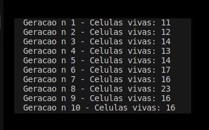
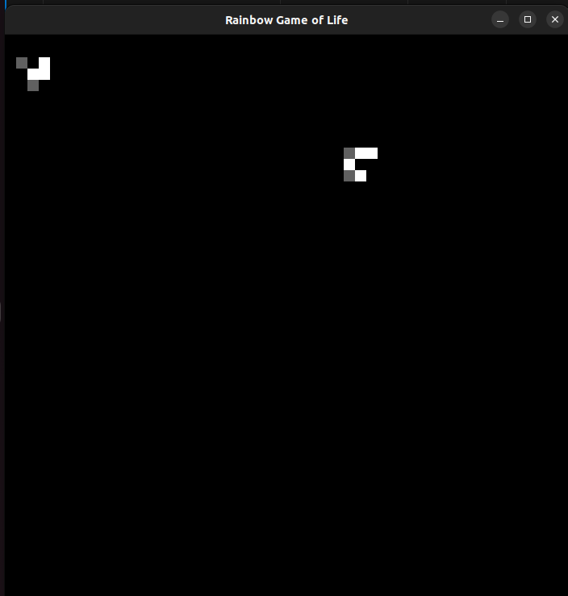
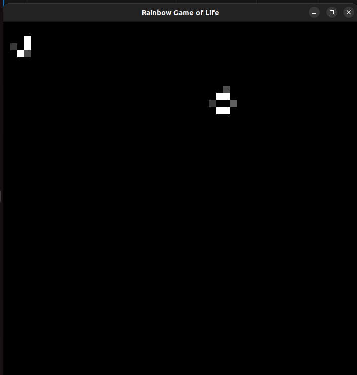
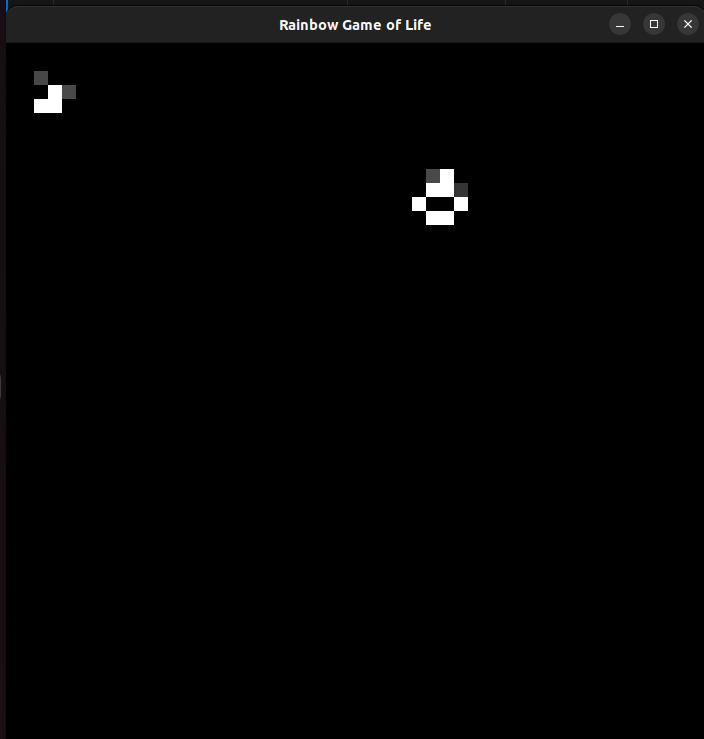
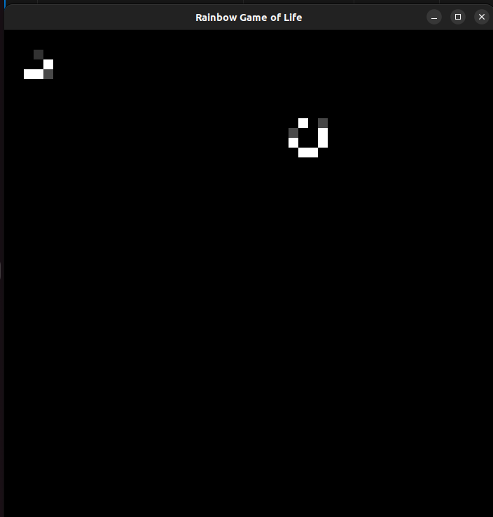
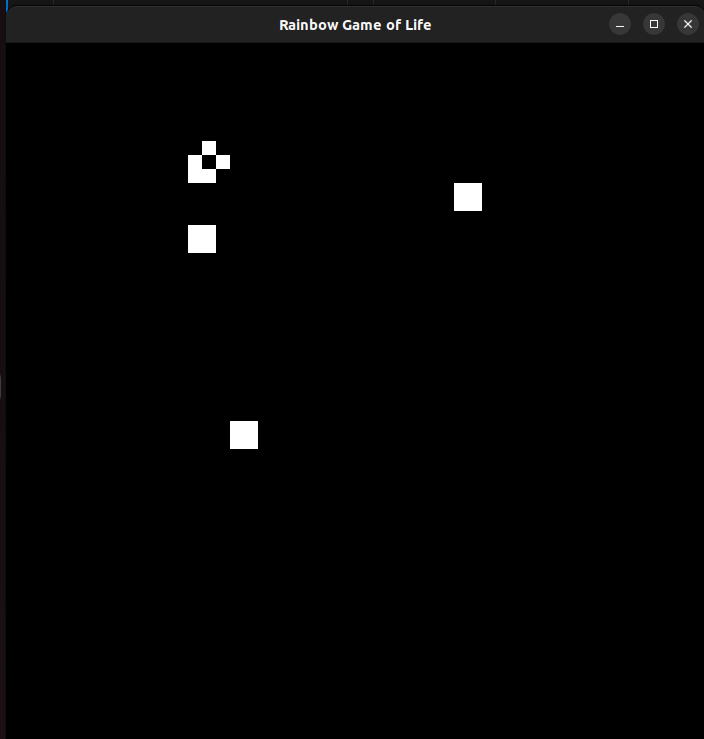

# 🌈 Rainbow Game Of Life

Repositório para códigos da atividade 1 da disciplina de Programação Concorrente e Distribuída, ministrada no 2sem/2023, no ICT-Unifesp.

### Alunos
Hélio Didzec Júnior \
Yasmin Beatriz Deodato

### Informações

#### 0️⃣ Compilar
```bash
# versao sequencial
gcc -o rainbow rainbowGameOfLife.c
# versao concorrente - pthreads
gcc -o rainbow rainbowGameOfLife.c -lpthread
# versao concorrente - openmp
gcc -o rainbow rainbowGameOfLife.c -fopenmp
# versao grafica e sequencial - opengl
gcc -o rainbow rainbowGameOfLifeGrafico.c -lGL -lGLU -lglut
```
#### 1️⃣ Executar
```bash
./rainbow
time ./rainbow
```

### Resultados
Em todas as versões, a partir do terminal, podemos verificar o número da geração e o respectivo número de células vivas.
#### Visualização no terminal


Para verificar as representações gráficas, execute a versão da pasta [`/versaoRepresentacaoGrafica`](/versaoRepresentacaoGrafica)

#### **Geração 0** 
🦠 Células Vivas: 10 


#### **Geração 1** 
🦠 Células Vivas: 11



#### **Geração 2** 
🦠 Células Vivas: 12




#### **Geração 3** 
🦠 Células Vivas: 14



#### **Geração 4** 
🦠 Células Vivas: 13



#### **Geração 2000** 
🦠 Células Vivas: 51

